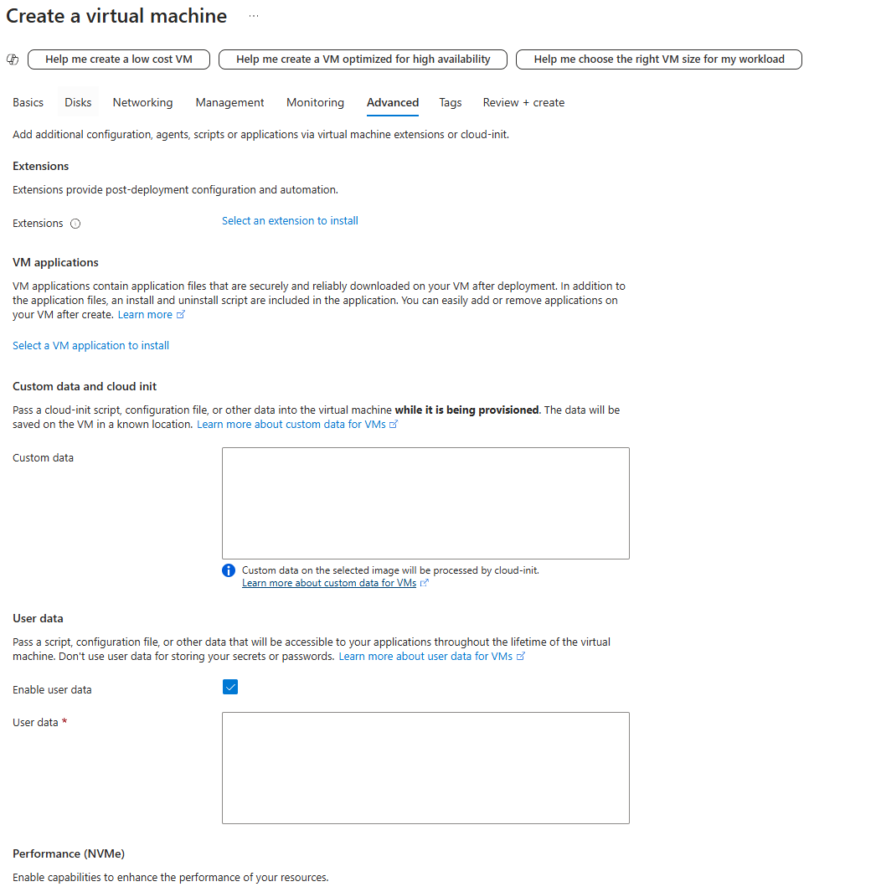

# How to automate the 2-tier Sparta app cloud deployment

## Overview

### developing app script

I first started my making a clean VM on ubuntu 22.04 as shown in making-a-vm(README.md) then opened the VM terminal window with the command ssh -i ~/.ssh/cloudfun1-jack-az-key adminuser@[public IP].

Working through the terminal to setup the app I developed a script (prov-app.sh) to automate the deployment of the app through a script run on the VM terminal

#### Bash Script Example

```bash
# Create a Bash script for provisioning
nano prov-app.sh

# Give execute permissions to the script
sudo chmod +x prov-app.sh

# Run the script
./prov-app.sh

# Check app is running
pm2 list
```

### developing database script

When creating the VM ports 80 and 3000 must be added inbound in networking tab

Working through the terminal to setup the database using https://www.mongodb.com/docs/v7.0/tutorial/install-mongodb-on-ubuntu/ I developed a script (prov-db.sh) to automate the deployment of the app through a script run on the VM terminal

#### Bash Script Example

```bash
# Create a Bash script for provisioning
nano prov-db.sh

# Give execute permissions to the script
sudo chmod +x prov-db.sh

# Run the script
./prov-db.sh

# Test database running
sudo systemctl status mongod
```

### Using user data to further automate deployment

For the app deployment copy the prov-app.sh script into user data and once pasted do NOT edit in the user data as it cancause issues.

do the exact same for the prov-db.sh on a different VM

This user data method speeds up the time it takes to deploy the app considerably from 5 min to around 1-2 mins in my case. 

make sure to create the database Vm before the app as the posts page cannot populate if there is no database.



### Using user data VM's to create images that can be used to speed up automation

To create an image of the database VM can create the VM exactly the same as above except when picking an image use ramon-official-ubuntu2204-clean-image to stop any issues with giving credit this also applies for the app VM.

For the app VM you must change the user data enter by leaving out all of the script under the comment `# exclude everything below from user data when using VM to create image` in prov-app.sh.

Then you can capture the VM's as an image using the option on the overview bar. For simplicity untick the 'Share image to Azure compute gallery' and name it appropriately.

Now you have 2 images 1 for the database and 1 for the app

### Using images to deploy 2-tier Sparta app

now we have the images when we make a new VM we can select are image from the 'My Images' section and create the VM's much faster.

Remember to make the database first and to add port 80 & 3000 inbound rules and for the app VM a short script must be put in the user data run-app-only.sh to start the app.

## overview of cloud architecture (ran out of time to make a diagram)

# Overview

This document describes the automated deployment of a 2-tier Sparta application architecture in a cloud environment.

1. **Nginx Reverse Proxy**:
   - Takes users to the Node.js application when the public IP is put in URL.
   
2. **Node.js Application**:
   - Hosted on a virtual machine, serving as the front-end and application logic.
   - Managed using `pm2` to ensure reliability.

3. **MongoDB Database**:
   - A back-end database hosted on a separate virtual machine.
   - Configured to accept connections from the Node.js application using environment variables.

### Flow
1. A client accesses the application through the browser.
2. Requests made to **Nginx** (Reverse Proxy).
3. Nginx forwards request to the **Node.js Application** running on port 3000.
4. The application talks to **MongoDB Database** for back-end operations for the posts page.

## Blockers

To be honest i did not experience many blockers and anything that didnt work was an easy issue for me to fix so i cant remember what they were. But I can say that when first making the user data for the VM app for creating my image it did not work correctly and i needed to reformat my script slightly to make it work.

